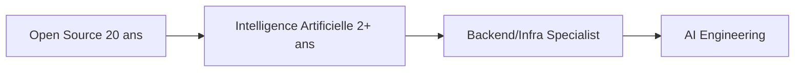

# 👋 Bonjour, moi c'est Jean-Claude LUNION

---

## 🚀 À propos de moi

Passionné par l'informatique et l'innovation technologique, je suis **Développeur Full Stack** et **Support IT** avec une expertise approfondie dans le développement open source et l'intelligence artificielle. Actuellement **Lounge IT Advisor** chez **SCC France** pour **Safran Aircraft Engines** à Corbeil, je conjugue mon expérience terrain avec une veille technologique active.

- 🔭 **Expérience** : ~20 ans dans l'open source, ~2 ans en IA
- 🌱 **Apprentissage continu** : Backend/Infra, DevOps, AI Engineering
- 💼 **Entrepreneur** : Fondateur de LAKENA (Conseil en systèmes informatiques)
- 🎯 **Objectifs** : Développer des solutions logiciels innovantes et contribuer à l'écosystème open source

---

## 💻 Technologies & Compétences

### Langages & Frameworks

### Intelligence Artificielle

### Outils & Plateformes

### Infrastructure & DevOps

---

## 🎯 Projets Phares

### 🛰️ [Spacetrack](https://spacetrack.jclunion.fr/iss)

**Application web de suivi en temps réel de la Station Spatiale Internationale (ISS)**

Une plateforme interactive permettant de visualiser la position de l'ISS en temps réel, avec des fonctionnalités avancées de tracking et de prédiction des passages visibles.

**Technologies utilisées :**
- 🚀 TypeScript & Node.js pour le backend
- 🌐 HTML5/CSS3 pour l'interface responsive
- 🗺️ APIs spatiales (TLE data, trajectoires orbitales)
- 📡 Intégration WebSocket pour les mises à jour en temps réel
- 🐧 Déployé sur infrastructure Linux

**Fonctionnalités clés :**
- ✅ Tracking en temps réel de la position de l'ISS
- ✅ Visualisation 2D/3D de l'orbite
- ✅ Prédictions des passages visibles selon localisation
- ✅ Données télémétriques (altitude, vitesse, coordonnées)
- ✅ Interface multiplateforme et responsive

---

## 📊 Statistiques GitHub

---

## 🏆 Réalisations & Certifications

### Projets Professionnels
- 🚀 **Spacetrack** - Application de tracking satellitaire en production
- 🏢 **SCC France** - Support IT & Infrastructure pour Safran Aircraft Engines
- 💡 **LAKENA** - Entreprise de conseil et prestations informatiques (2015-2019)

### Formation & Développement
- 📚 **Autodidacte** - Apprentissage continu via projets pratiques
- 🎓 Lycée Formeca Fessart (BTS Productique - 1992, alternance)
- 🔄 En cours : Spécialisation Backend/Infrastructure
- 🤖 Expertise AI : Ollama, ChatGPT, Gemini, Perplexity

---

## 📈 Contributions Open Source

---

## 🎓 Parcours d'Apprentissage

**Compétences en développement :**
- ✅ Architecture Full Stack
- ✅ APIs RESTful & WebSocket
- ✅ DevOps & CI/CD
- ✅ Infrastructure Linux
- ✅ Cloud Computing
- 🔄 Machine Learning (en cours)
- 🔄 Kubernetes & Containerisation (en cours)

---

## 📫 Me Contacter

**Localisation :** 📍 Brétigny-sur-Orge, Île-de-France, France

---

## 💭 Citation Favorite

> *"L'apprentissage est un trésor qui suivra son propriétaire partout."* - Proverbe chinois

---

## 🔗 Liens Utiles

- 🛰️ **Spacetrack ISS Tracker** : [https://spacetrack.jclunion.fr/iss](https://spacetrack.jclunion.fr/iss)
- 💼 **Repository GitLab** : [https://gitlab.com/saas692049/spacetrack](https://gitlab.com/saas692049/spacetrack)
- 🏢 **SCC France** : [Page entreprise](https://france.scc.com)

---

### 📊 Profil Visiteurs

**Merci de votre visite ! N'hésitez pas à explorer mes projets et à me contacter.**

---

*Dernière mise à jour : Novembre 2025*

